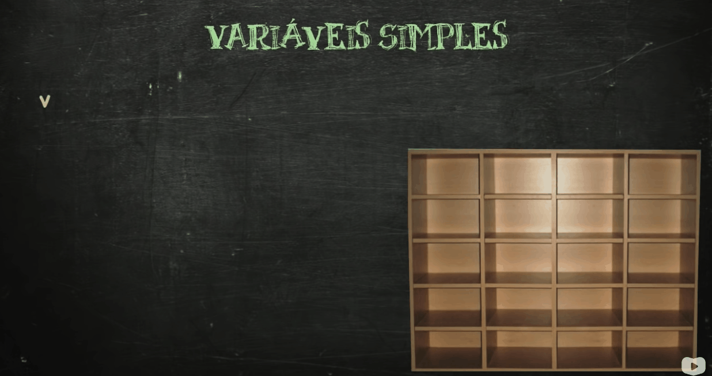
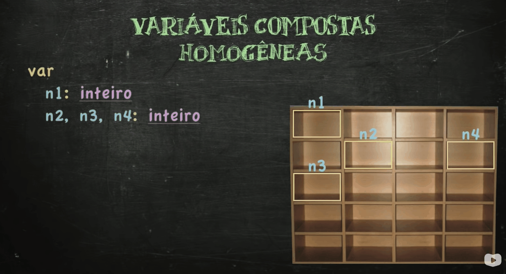

# 🗄 Aula 14 - Vetores (Variáveis Compostas - Parte 1)

<br>

> Lembrando: Durante todo este curso, será utilizado o **visualg** (visualizador de algoritmos) para poder desenvolver algoritmos em **Portugol**.

<br>

> 🖖 Essas anotações foram feitas a partir das aulas do professor **Gustavo Guanabara**. <br>
> 👉 Link para acessar as vídeo-aulas e os materiais do curso: https://www.cursoemvideo.com/curso/curso-de-algoritmo/

<br>

> Até o momento só utilizamos variáveis simples. A partir de agora, iremos trabalhar com **_variáveis compostas_**.

<br>

### Relembrando

<br>

- ***Variáveis*** são **espaços** na memória do computador que servem para **armazenar dados**.

- **Variáveis Simples** são variáveis que só podem armazenar um único dado.

- Vamos utilizar a analogia que utilizamos no início do curso na qual consideramos a memória do computador sendo um grande "armário" e os espaços desse armário sendo as variáveis. 

- Olha só o que acontece quando declaramos e atribuimos valores em variáveis simples: 

<br>

<div align="center">
    
</div>

<br>

- Reparou que as variáveis foram **dispostas de forma BAGUNÇADA** na memória do computador? É justamente isso que acontece com as variáveis simples, elas são alocadas conforme a necessidade do sistema operacional.

- Com **vetores** as coisas funcionam um pouco diferente...

<br>

## **O que são Vetores?**

- Vetores, nada mais são, que **variáveis** (ou seja, servem para armazenar dados na memória do computador). Porém, não são variáveis simples mas sim **variáveis compostas**.

   - Isso quer dizer que um único vetor é composto por **mais de um espaço** na memória do computador.

- Olha só como funciona a **declaração** de um vetor, sua **alocação** na memória do computador e sua **atribuição** de valores:

<br>

<div align="center">
    
</div>

<br>

- O que podemos observar:

   - Um vetor já se diferencia de uma variável simples na **declaração**.

      - A declaração de um vetor é composta por: {nomeDaVariavel + vetor[quantidadeDeEspaçosDisponíveis] + tipoDaVariavel}.

   - A **alocação** de um vetor é feita de maneira **organizada** e **sequencial**, direntemente do que ocorre com as variáveis simples.

   - Para **atribuir valores** num vetor também funciona de maneira um pouco diferente das variáveis simples.

      - A atribuição de valor num vetor exige: {nomeDaVariavel[inidice]}

      - Como já sabemos, um vetor é uma variável composta (portanto, é formado por mais de um espaço na memória do computador),
      por esse motivo que, ao atribui valores num vetor, é necessário colocar o nome do vetor e (entre colchetes) o que chamamos de **ÍNDICE**.

      - O índice serve para indicar uma **posição** específica dentro de um vetor.
   
   > Por fim, é notório o grande poder de um vetor: ao invés de utilizarmos 4 variáveis para armazenar 4 valores, 
   > com os vetores, é preciso somente 1 variável para armazenar 4 valores (ou mais).

<br>

## **Variável Simples X Variável Composta**

<br>

| Variável Simples | Variável Composta |
| ---------------------------------- | -------------------------------------- |
| Capacidade para armezanar um único valor | Capacidade para armazenar mais de um valor |
| Composta por um único espaço na memória | Composta por mais de um espaço na memória |
| São alocadas de forma bagunçada | São alocadas de forma ordenada e sequencial |

- Suas declarações e atribuições  de valores são diferentes também.

<br>

## **Vetores - Variáveis Compostas Homogêneas Unidimensionais**

- Tecnicamente falando, os vetores são chamados de um nome bem maior: Variáveis Compostas Homogêneas Unidimensionais

- Não precisa se assustar, cada palavra desse nome tem um porquê:

  - **Variáveis**: Pois os vetores são espaços ("gavetas") na memória do computador ("armário") que servem para armazenar dados.

  - **Compostas**: Pois os vetores são variáveis compostas por mais de um espaço na memória do computador.

  - **Homegêneas**: Pois os espaços que compõe um vetor armazenarão dados do mesmo tipo (lembra que vimos que, ao declarar um vetor, foi preciso informar o tipo dele e que ele foi composto, justamente, apenas com dados desse tipo?).

  - **Unidemensionais**: Pois para identificar cada um dos espaços de um vetor é necessário somente um índice (somente um "endereço" para identificar uma posição dentro do vetor).

<br>

### 🏋️‍♂️ **Exercício Prático - Construindo Um Vetor :**

<br>

- Desenvolva um algoritmo que leia 5 números, armazene-os dentro de um vetor e exiba esse vetor na tela.

<br>

```
algoritmo "Construindo Um Vetor"

var
   v: vetor[1..5] de inteiro
   i: inteiro

inicio
   Para i <- 1 ate 5 faca
      Escreva("Digete o ", i, "° número: ")
      Leia(v[i])
   FimPara

   EscrevaL()
   Escreva("Vetor Completo: ")
   Para i <- 1 ate 5 faca
      Escreva("{", v[i], "}")
   FimPara

fimalgoritmo
```

<br>

### 🏋️‍♂️ **Exercício Prático - Total de Valores Pares :**

<br>

- Crie um algoritmo que leia sete números, armazene-os dentro de um vetor, analise quais desses números são pares e informe qual a posição desses números e o total de números pares encontrado.

<br>

```
algoritmo "Total de Valores Pares"

var
  n: vetor[1..7] de Inteiro
  i, totPar: Inteiro

inicio
   Para i <- 1 ate 7 faca
      Escreva("Digite o ", i, "° número: ")
      Leia(n[i])
   FimPara

   EscrevaL()

   Para i <- 1 ate 7 faca
      Se (n[i] % 2 = 0) entao
         totPar <- totPar + 1
         EscrevaL("Número ", n[i], " na ", i, "° posicao é PAR!")
      FimSe
   FimPara

   EscrevaL()
   EscrevaL("Total de Números Pares Digitados: ", totPar)

fimalgoritmo
```

<br>

### 🏋️‍♂️ **Exercício Prático - Litagem de Alunos Acima da Média :**

<br>

- Desenvolva um algoritmo que leia o nome e duas notas de 5 alunos, calcule a média de cada um, a média da turma toda e analise se o aluno foi aprovado (nota maior ou igual a 7), reprovado (nota abaixo abaixo de 5) ou está em recuperação (nota maior ou igual a 5 e menor que 7).

- Exiba na tela a média de toda a turma e uma lista com o nome dos alunos, suas respectivas médias e situação (aprovado, reprovado ou em recuperação)

<br>

```
algoritmo "Litagem de Alunos Acima da Média"

var
  nome: vetor[1..5] de Caractere
  nota1: vetor[1..5] de Real
  nota2: vetor[1..5] de Real
  media: vetor[1..5] de Real
  status: vetor[1..5] de Caractere
  somaMedias, mediaTurma: Real
  i: Inteiro

inicio
   Para i <- 1 ate 5 faca
      EscrevaL("--------------------")
      EscrevaL("DADOS DO ALUNO ", i)
      EscrevaL("--------------------")
      Escreva("Nome: ")
      Leia(nome[i])
      Escreva("Nota 1: ")
      Leia(nota1[i])
      Escreva("Nota 2: ")
      Leia(nota2[i])

      media[i] <- (nota1[i] + nota2[i])/2

      Se (media[i] >= 7) entao
         status[i] <- "APROVADO(A)"
      senao
         Se ((media[i] >= 5) e (media[i] < 7)) entao
               status[i] <- "RECUPERAÇÃO"
         senao
               status[i] <- "REPROVADO(A)"
         FimSe
      FimSe

      somaMedias <- somaMedias + media[i]
   FimPara

   LimpaTela

   mediaTurma <- somaMedias / 5

   EscrevaL ("A media da turma é ", mediaTurma:4:1)
   EscrevaL("-----------------------------------")
   EscrevaL("         Listagem de Alunos        ")
   EscrevaL("-----------------------------------")
   Para i <- 1 ate 5 faca
      EscrevaL(nome[i], "   ", media[i]:4:1, "   ", status[i])
   FimPara

fimalgoritmo
```

<br>

### 🏋️‍♂️ **Exercício Prático - Só Importa Quem Começa Com C :**

<br>

- Desenvolva um Algoritmo que leia 7 nomes, coloque todos aqueles que começam com "C" dentro de um vetor e depois exiba-o na tela.

<br>

```
algoritmo "Só Importa Quem Começa Com C"

var
  nome: Caractere
  iniciamComC: vetor[1..7] de Caractere
  c, totalComC: Inteiro

inicio
   Para c <- 1 ate 7 faca
      Escreva("Digite o ", c, "° nome: ")
      Leia(nome)

      Se (copia(maiusc(nome), 1, 1) = "C") entao
         totalComC <- totalComC + 1
         iniciamComC[totalComC] <- nome
      FimSe
   FimPara

   LimpaTela

   EscrevaL("NOMES DIGITADOS QUE COMEÇAM COM C")
   EscrevaL("---------------------------------")
   Para c <- 1 ate totalComC faca
      EscrevaL(iniciamComC[c])
   FimPara

fimalgoritmo
```

<br>

### 🏋️‍♂️ **Exercício Prático - Ordenação de Vetor :**

<br>

- Crie um algoritmo que lei 7 valores e coloque esses valores em ordem. Porém, deve permitir o usuário escolher qual a forma de ordanação que será feita (crescente ou decrescente).

<br>

```
algoritmo "Ordenação de Vetor"

var
   v: vetor[1..7] de Inteiro
   c, ordem: Inteiro

   Procedimento OrdemCrescente()
   var
      i, j, auxiliar: Inteiro
   inicio
      Para i <- 1 ate 6 faca
         Para j <- i+1 ate 7 faca
            Se (v[i] > v[j]) entao
               auxiliar <- v[i]
               v[i] <- v[j]
               v[j] <- auxiliar
            FimSe
         FimPara
      FimPara
   FimProcedimento

   Procedimento OrdemDecrescente()
   var
      i, j, auxiliar: Inteiro
   inicio
      Para i <- 1 ate 6 faca
         Para j <- i+1 ate 7 faca
            Se (v[i] < v[j]) entao
               auxiliar <- v[i]
               v[i] <- v[j]
               v[j] <- auxiliar
            FimSe
         FimPara
      FimPara
   FimProcedimento

inicio
    EscrevaL(" ORDENANDO UM VETOR ")
    EscrevaL("====================")

    Para c <- 1 ate 7 faca
      Escreva("Digite o ", c, "° valor: ")
      Leia(v[c])
    FimPara

    EscrevaL()
    EscrevaL("Qual forma de Ordenação?")
    EscrevaL("[1] Ordem Crescente")
    EscrevaL("[2] Ordem Decrescente")
    Leia(ordem)
    Escolha ordem
      Caso 1
         OrdemCrescente()
      Caso 2
         OrdemDecrescente()
    FimEscolha


    EscrevaL()
    EscrevaL("-------------------------------")
    Escreva("Vetor Ordenado: ")
    Para c <- 1 ate 7 faca
      Escreva (v[c], " ")
    FimPara
    EscrevaL()
    EscrevaL("-------------------------------")

fimalgoritmo
```

<br>

### 🏋️‍♂️ **Exercício Proposto - Torneio de Futebol :**

<br>

- Desenvolva um algoritmo que leia o nome de 3 times de futebol e crie uma tabela com todas as combinações de partidas possíveis entre os três times.

<br>

```
algoritmo "Torneio de Futebol"

var
  time: vetor[1..3] de Caractere
  i, j: Inteiro

inicio
   EscrevaL("------------------")
   EscrevaL("CAMPEONATO FUTEBOL")
   EscrevaL("------------------")
   Para i <- 1 ate 3 faca
      Escreva ("Nome do ", i, "° time: ")
      Leia(time[i])
   FimPara

   LimpaTela

   EscrevaL("-------------------")
   EscrevaL(" TABELA DE PARTIDAS")
   EscrevaL("-------------------")
   Para i <- 1 ate 3 faca
      Para j <- 1 ate 3 faca
         Se (i <> j) entao
            EscrevaL(time[i]:12, " [ ] x [ ] ", time[j]:12)
         FimSe
      FimPara
   FimPara

fimalgoritmo
```

<br>

### 🏋️‍♂️ **Exercício Prático - Corrigindo Provas :**

<br>

- Crie um algoritmo que permita o usuário cadastrar o gabarito de uma prova com 5 questões, o nome e as respostas de 3 alunos; Calcule a nota final de cada aluno,
  a média da turma e exiba os resultados.

<br>

```
algoritmo "Corrigindo Provas"

var
   gabaritoProva: vetor[1..5] de Caractere
   gabaritoAluno: vetor[1..5] de Caractere
   nome: vetor[1..3] de Caractere
   nota: vetor[1..3] de Real
   i: Inteiro
   soma, media: Real

Procedimento CadastroGabarito()
var
   c: Inteiro
inicio
   EscrevaL("PASSO 1 - Cadastro de Gabarito ")
   EscrevaL("-------------------------------")
   Para c <- 1 ate 5 faca
      Escreva("Questao ", c, ": ")
      Leia(gabaritoProva[c])
   FimPara
FimProcedimento

Funcao CadastraProva(): Real
var
   c: Inteiro
   notaFinal: Real
inicio
   EscrevaL()
   EscrevaL("=> RESPOSTAS DADAS:")
   EscrevaL()

   Para c <- 1 ate 5 faca
      Escreva("Questao ", c, ": ")
      Leia(gabaritoAluno[c])
      Se (Maiusc(gabaritoAluno[c]) = Maiusc(gabaritoProva[c])) entao
         notaFinal <- notaFinal + 2
      FimSe
   FimPara

   Retorne notaFinal
FimFuncao

inicio
    CadastroGabarito()

    Para i <- 1 ate 3 faca
         LimpaTela
         EscrevaL("------------------------")
         EscrevaL("ALUNO ", i)
         EscrevaL("------------------------")
         Escreva("Nome: ")
         Leia(nome[i])
         nota[i] <- CadastraProva()
         soma <- soma + nota[i]
    FimPara

    LimpaTela
    EscrevaL("NOTAS FINAIS ")
    EscrevaL("-----------------------------")
    Para i <- 1 ate 3 faca
      EscrevaL(nome[i]:10, nota[i]:4:1)
    FimPara
    media <- soma / 3
    EscrevaL("-----------------------------")
    EscrevaL("Media da Turma: ", media:4:1)
fimalgoritmo
```

<br>

### 🏋️‍♂️ **Exercício Prático - Reservar Espaço no Cinema :**

<br>

- Desenvolva um algoritmo que exiba uma fileira de cinema com 10 lugares e permita o usuário escolher quantas cadeiras quiser. Ao usuário escolher uma cadeira, 
o programa deve exbir a cadeira como ocupada e, se o usuário escolher uma cadeira ocupada, deve alertar que aquele lugar já foi reservado.

<br>

````
algoritmo "Reservar Espaço no Cinema"

var
   B: vetor[1..10] de Caractere
   numeroDaCadeira: Inteiro
   resposta: Caractere

Procedimento MostraFileira()
var i: Inteiro
inicio
   Para i <- 1 ate 10 faca
      Se (B[i] = "") entao
         Escreva ("[ B", i:2, " ]")
      senao
         Escreva ("[ --- ]")
      FimSe
   FimPara

   EscrevaL()
   EscrevaL("------------------------------------------------------------------------")
FimProcedimento

inicio
   Repita
      LimpaTela

      MostraFileira()

      Escreva("Reservar a cadeira: B")
      Leia(numeroDaCadeira)
      EscrevaL()

      Se (B[numeroDaCadeira] = "") entao
         B[numeroDaCadeira] <- "X"
         EscrevaL("Cadeira B", numeroDaCadeira, " RESERVADA!")
      Senao
         EscrevaL("ERRO: Lugar Ocupado!")
      FimSe

      EscrevaL()
      Escreva("Quer reservar outro? [S/N] ")
      Leia(resposta)
   Ate (resposta = "N")
   
fimalgoritmo
````

<br>

<a href="../README.md">Voltar</a>