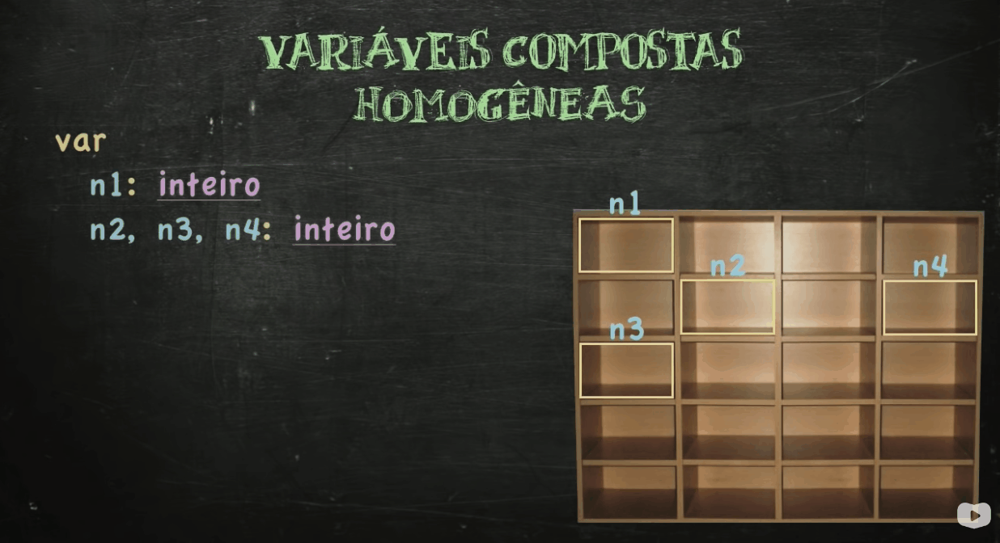

# 🗄🗄 Aula 15 - Matrizes (Variáveis Compostas - Parte 2)

<br>

> Lembrando: Durante todo este curso, será utilizado o **visualg** (visualizador de algoritmos) para poder desenvolver algoritmos em **Portugol**.

<br>

> 🖖 Essas anotações foram feitas a partir das aulas do professor **Gustavo Guanabara**. <br>
> 👉 Link para acessar as vídeo-aulas e os materiais do curso: https://www.cursoemvideo.com/curso/curso-de-algoritmo/

<br>

## **O que são Matrizes?**

- Matrizes, antes de qualquer coisa, são **variáveis** (ou seja, servem para armazenar dados na memória do computador). Porém,  assim como os vetores, não são variáveis simples mas sim **variáveis compostas** (ou seja, são formadas por mais de um espaço na memória do computador).

- O funcionamento das matrizes possui pontos semelhantes ao dos vetores, contudo, o diferencial das matrizes é: a capacidade delas de possuirem **mais de uma dimensão**. 

- Vamos com calma. Para entender esse conceito de mais de uma dimensão das matrizes, vamos reelembrar alguns pontos vistos sobre os vetores:

<br>

<div align="center">
    
</div>

<br>

- É importante prestarmos atenção nos seguintes pontos:

   1. A forma de declaração do vetor. {nomeDaVariavel + vetor[quantidadeDeEspaçosDisponíveis] + tipoDaVariavel}

   2. A forma na qual o vetor é disposto na memória do computador. {forma ordenada e sequencial em linha}

   3. A forma de atribuir valores no vetor. {nomeDaVariavel[inidice]}


- Show! Tendo isso em mente, vamos observar como é feita: a declaração, a diposição na memória do computador e a atribuição de valores numa MATRIZ.


- Variáveis: pois as matrizes são espaços ("gavetas") na memória do computador ("armário") que servem para armazenar dados.

- Compostas: pois as matrizes são variáveis compostas por mais de um espaço na memória do computador.

- Homegêneas: pois os espaços que compõe uma matriz são do mesmo tipo.

- Multidimensionais: pois para identificar cada um dos espaços de uma matriz é necessário mais de um "endereço" (mais de um índece).

<br>

## **Declarando Uma Matriz**

<br>

- Exemplo: declarando uma matriz m de três linhas e duas colunas (3x2)

```
var
   m: vetor[1..3, 1..2] de inteiro   // vetor[n° de linhas, n° de colunas]
```

<br>

## **Atribuindo Valores Numa Matriz**

<br>

- Ao contrário dos vetores, para atribuir valores em uma matriz é necessário utilizar
  mais de um índice (na maioria dos casos, apenas dois, o 1° representa linha e o
  2° a coluna na qual o valor será inserido).

```
var
  m: vetor[1..3, 1..2] de inteiro

inicio
  m[1, 1] <- 2    // atribuindo/armazenando o valor 2, na matriz m, na posição 1,1  (linha 1, coluna 1)
  m[1, 2] <- 4    // atribuindo/armazenando o valor 4, na matriz m, na posição 1,2  (linha 1, coluna 2)
  m[2, 1] <- 3    // atribuindo/armazenando o valor 8, na matriz m, na posição 2,1  (linha 2, coluna 1)
  m[2, 2] <- 6    // atribuindo/armazenando o valor 6, na matriz m, na posição 2,2  (linha 2, coluna 2)
  m[3, 1] <- 1    // atribuindo/armazenando o valor 1, na matriz m, na posição 3,1  (linha 3, coluna 1)
  m[3, 2] <- 2    // atribuindo/armazenando o valor 1, na matriz m, na posição 3,2  (linha 3, coluna 2)
```

<br>

### 🏋️‍♂️ **Exercício Prático - Construindo Uma Matriz :**

<br>

- Desenvolva um algoritmo que leia seis números, coloque-os dentro de uma matriz 3x2
  (3 linhas e 2 colunas) e exiba essa matriz.

<br>

```
algoritmo "Construindo Uma Matriz"

var
  m: vetor[1..3, 1..2] de inteiro
  linha, coluna: inteiro

inicio
  EscrevaL("Construindo Uma Matriz")
  EscrevaL("======================")
  Para linha <- 1 ate 3 faca
    Para coluna <- 1 ate 2 faca
      Escreva("Digite o valor da posição [", linha, ",", coluna, "] : ")
      Leia(m[linha, coluna])
    FimPara
  FimPara

  EscrevaL()
  Para linha <- 1 ate 3 faca
    Para coluna <- 1 ate 2 faca
      Escreva(m[linha, coluna]:5)
    FimPara
    EscrevaL()
  FimPara

fimalgoritmo
```

<br>

### 🏋️‍♂️ **Exercício Prático - Construir uma Matriz e Mostrando os Pares :**

<br>

- Desenvolva um algoritmo que leia nove números, coloque-os dentro de uma matriz 3x3
  (3 linhas e 3 colunas), exiba essa matriz e destaque os números que forem pares.

<br>

```
algoritmo "Construir uma Matriz e Mostrando os Pares"

var
  m: vetor[1..3, 1..3] de Inteiro
  linha, coluna, totalPares: Inteiro
inicio
   Para linha <- 1 ate 3 faca
      Para coluna <- 1 ate 3 faca
         Escreva ("Digite o valor da posicao [", linha, ",", coluna, "]: ")
         Leia(m[linha, coluna])
      FimPara
   FimPara

   EscrevaL()
   EscrevaL("MATRIZ")
   EscrevaL("------")
   totalPares <- 0
   Para linha <- 1 ate 3 faca
      Para coluna <- 1 ate 3 faca
         Se(m[linha, coluna] % 2 = 0) entao
             Escreva("{", m[linha, coluna]:2, "}")
             totalPares <- totalPares + 1
         senao
             Escreva(m[linha, coluna]:4)
         fimSe
      FimPara
      Escreval()
   FimPara

   EscrevaL()
   EscrevaL("Ao todo foram digitados ", totalPares, " números PARES")
fimalgoritmo
```

<br>

### 🏋️‍♂️ **Exercício Prático - Criar uma Matriz Identidade de 3° Ordem :**

<br>

- Matriz identidade é uma matri cuja diagonal principal (formada por posições nas quais o 
número da linha é igual ao da coluna) só tem valor 1 e as demais posições têm valor 0.

- Desenvolva um algoritmo que crie uma matriz identidade de 3° ordem (3x3).

````
algoritmo "Criar uma Matriz Identidade de 3° Ordem"

var
  m: vetor[1..3, 1..3] de Inteiro
  i, j: Inteiro

inicio
  Para i <- 1 ate 3 faca
    Para j <- 1 ate 3 faca
      Se (i = j) entao
        m[i,j] <- 1
      senao
        m[i,j] <- 0
      FimSe
    FimPara
  FimPara
  
  Para i <- 1 ate 3 faca
    Para j <- 1 ate 3 faca
      Escreva (m[i,j]:3)
    FimPara
    EscrevaL()
  FimPara
    
fimalgoritmo
````

<br>

### 🏋️‍♂️ **Exercício Prático - Brincando Com Uma Matriz de 4° ordem :**

<br>

- Crie um algoritmo que leia dezesseis números, coloque-os dentro de uma matriz de 4° ordem (4x4) e,

  - Exiba essa matriz

  - Calcule e mostre a soma dos valores da diagonal principal.

  - Calcule e mostre o produto entre os valores da segunda linha.

  - Identifique e mostre o maior valor da terceira coluna.

````
algoritmo "Brincando Com Uma Matriz de 4° ordem"

var
  m: vetor[1..4, 1..4] de Inteiro
  i, j, somaDiagonalPrincipal, produtoSegundaLinha, maiorTerceiraColuna: Inteiro

inicio
  somaDiagonalPrincipal <- 0
  produtoSegundaLinha <- 1
  Para i <- 1 ate 4 faca
    Para j <- 1 ate 4 faca
      Escreva("Digite o valor da Posicao [", i, ",", j, "]: ")
      Leia(m[i, j])
      Se (i = j) entao
        somaDiagonalPrincipal <- somaDiagonalPrincipal + m[i ,j]
      FimSe
    FimPara
  FimPara

  EscrevaL()
  Para i <- 1 ate 4 faca
    Para j <- 1 ate 4 faca
      Escreva(m[i, j]:4)
    FimPara
    EscrevaL()
  FimPara
  EscrevaL()

  Para i <- 1 ate 4 faca
    produtoSegundaLinha <- produtoSegundaLinha * m[2, i]
  FimPara

  Para i <- 1 ate 4 faca
    Se (m[i, 3] > maiorTerceiraColuna) entao
        maiorTerceiraColuna <- m[i, 3]
    FimSe
  FimPara

  EscrevaL("A soma dos valores da Diagonal Principal e ", somaDiagonalPrincipal)
  EscrevaL("O produto dos valores da Segunda Linha e ", produtoSegundaLinha)
  EscrevaL("O maior valor da Terceira Coluna e ", maiorTerceiraColuna)
fimalgoritmo
````

<br>

### 🏋️‍♂️ **Exercício Prático - Dissecando Matrizes :**

<br>

- Desenvolva um algoritmo para preencher uma matriz de quarta ordem e mostrar:

  - A matriz completa

  - Os elementos da diagonal principal

  - Os elementos do triangulo superior (o que sobra da diagonal principal na parte de cima)

  - Os elementos do triangulo inferior (o que sobra da diagonal principal na parte de baixo)

````
algoritmo "Dissecando Matrizes"

var
  m: vetor[1..4, 1..4] de Inteiro
  linha, coluna, opcao: Inteiro

Procedimento MostraMatriz()
inicio
  Para linha <- 1 ate 4 faca
    Para coluna <- 1 ate 4 faca
      Escreva(m[linha, coluna]:4)
    FimPara
    EscrevaL()
  FimPara
FimProcedimento

Procedimento DiagonalPrincipal()
var espaco: inteiro
inicio
  Para linha <- 1 ate 4 faca
    EscrevaL(m[linha , linha]:4)
    Para espaco <- 1 ate linha faca
      Escreva("    ")
    FimPara
  FimPara
FimProcedimento

Procedimento TrianguloSuperior()
var espaco: Inteiro
inicio
  Para linha <- 1 ate 3 faca
    Escreva("    ")
    Para coluna <- linha+1 ate 4 faca
      Escreva(m[linha, coluna]:4)
    FimPara
    EscrevaL()
    Para espaco <- 1 ate linha faca
      Escreva("    ")
    FimPara
  FimPara
  EscrevaL()
FimProcedimento

Procedimento TrianguloInferior()
inicio
  Para linha <- 2 ate 4 faca
    EscrevaL()
    Para coluna <- 1 ate linha-1 faca
      Escreva(m[linha, coluna]:4)
    FimPara
  FimPara
  EscrevaL()
FimProcedimento

inicio
  Para linha <- 1 ate 4 faca
    Para coluna <- 1 ate 4 faca
      Escreva("Digite valor para a posicao [", linha, ",", coluna, "]: ")
      Leia(m[linha, coluna])
    FimPara
  FimPara

  LimpaTela

  Repita
    EscrevaL()
    EscrevaL("MENU DE OPCOES")
    EscrevaL("====================")
    EscrevaL("[1] Mostrar a Matriz")
    EscrevaL("[2] Diagonal Principal")
    EscrevaL("[3] Triangulo Superior")
    EscrevaL("[4] Triangulo Inferior")
    EscrevaL("[5] Sair")
    Escreva("===== OPCAO: ")
    Leia(opcao)
    LimpaTela
    Escolha opcao
        Caso 1
          MostraMatriz()
        Caso 2
          DiagonalPrincipal()
        Caso 3
          TrianguloSuperior()
        Caso 4
          TrianguloInferior()
        Caso 5
          EscrevaL("ENCERRANDO...")
    FimEscolha
  Ate (opcao = 5)

fimalgoritmo
````

<br>

### 🏋️‍♂️ **Exercício Prático - Jogo da Velha :**

<br>

- Programe um algoritmo que crie um jogo da velha funcional.

````
algoritmo "Jogo da Velha"

var
  m: vetor[1..3, 1..3] de Caractere
  linha, coluna, i: Inteiro
  simbolo, posicao: Caractere
  jogada: Logico

Procedimento mostraVelha()
Inicio
  EscrevaL("+---+---+---+")
  Para linha <- 1 ate 3 faca
    Para coluna <- 1 ate 3 faca
      Escreva("|  ", m[linha, coluna]:1)
    FimPara
    Escreva("|")
    EscrevaL()
    EscrevaL("+---+---+---+")
  FimPara
FimProcedimento

Procedimento mudaJogador()
inicio
   Se (simbolo = "X") entao
      simbolo <- "O"
   senao
      simbolo <- "X"
   FimSe
FimProcedimento

Funcao Jogar(S: Caractere; P: Caractere): Logico
Var
  mudanca: logico
inicio
   Para linha <- 1 ate 3 faca
      Para coluna <- 1 ate 3 faca
        Se(m[linha, coluna] = P) entao
          m[linha, coluna] <- S
          mudanca <- verdadeiro
        FimSe
      FimPara
   FimPara

   Retorne mudanca
FimFuncao

Funcao terminouVelha(): Logico
Var
  terminou: Logico
  espacoNaoPreenchido: Inteiro
inicio
   // Jogos em linha
   Para linha <- 1 ate 3 faca
      Se (m[linha, 1] = m[linha, 2]) e (m[linha, 2] = m[linha, 3]) entao
         terminou <- verdadeiro
      FimSe
   FimPara

   // Jogos em coluna
   Para coluna <- 1 ate 3 faca
      Se (m[1, coluna] = m[2,coluna]) e (m[2, coluna] = m[3, coluna]) entao
         terminou <- verdadeiro
      FimSe
   FimPara

   // Jogos em diagonal
   Se (m[1,1] = m[2,2]) e (m[2,2] = m[3,3]) entao
      terminou <- verdadeiro
   FimSe
   Se (m[1,3] = m[2,2]) e (m[2,2] = m[3,1]) entao
      terminou <- verdadeiro
   FimSe

   // Jogos em VELHA
   Para linha <- 1 ate 3 faca
      Para coluna <- 1 ate 3 faca
         Se (m[linha, coluna] <> "X") e (m[linha, coluna] <> "O") entao
            espacoNaoPreenchido <- espacoNaoPreenchido + 1
         FimSe
      FimPara
   FimPara
   Se (espacoNaoPreenchido = 0) entao
      terminou <- verdadeiro
   FimSe

   // Retorna se o jogo acabou ou nao
   Retorne terminou
FimFuncao

inicio
  i <- 1
  simbolo <- "X"

  Para linha <- 1 ate 3 faca
    Para coluna <- 1 ate 3 faca
      m[linha, coluna] <- NumpCarac(i)
      i <- i + 1
    FimPara
  FimPara

  MostraVelha()

  Repita
    Repita
      Escreva("Vai jogar [", simbolo:1, "] em qual posicao? ")
      Leia(posicao)

      jogada <- Jogar(simbolo, posicao)

      Se (jogada = falso) entao
        EscrevaL("JOGADA INVALIDA!")
      FimSe
    Ate (jogada = verdadeiro)

    MudaJogador()
    LimpaTela
    MostraVelha()
  Ate (terminouVelha() = verdadeiro)

  EscrevaL("JOGO FINALIZADO!!!")
fimalgoritmo
````
